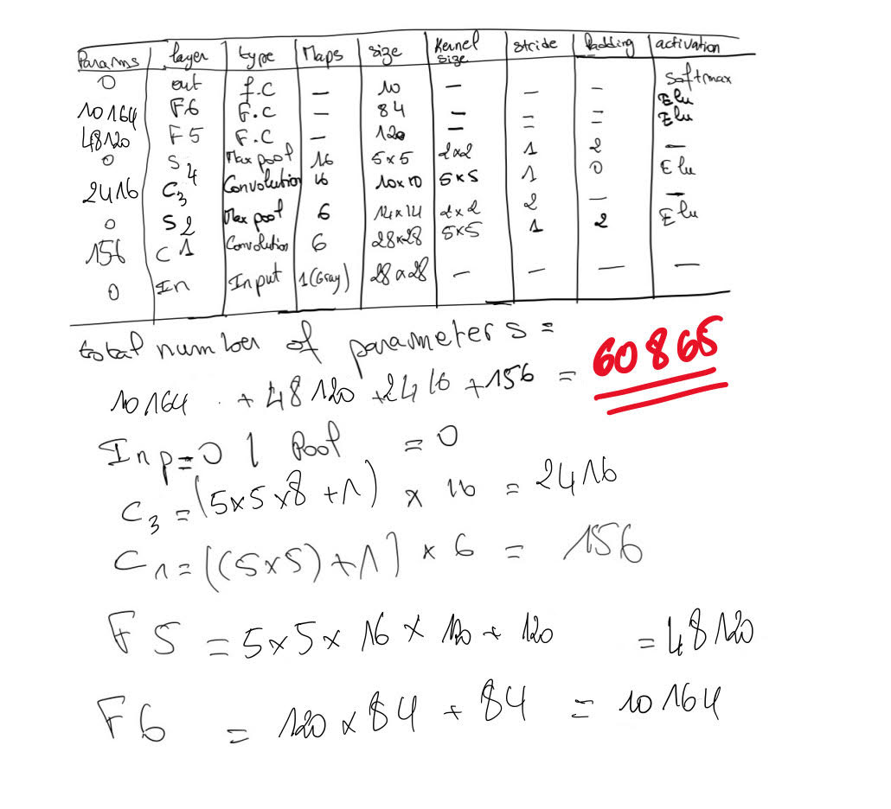
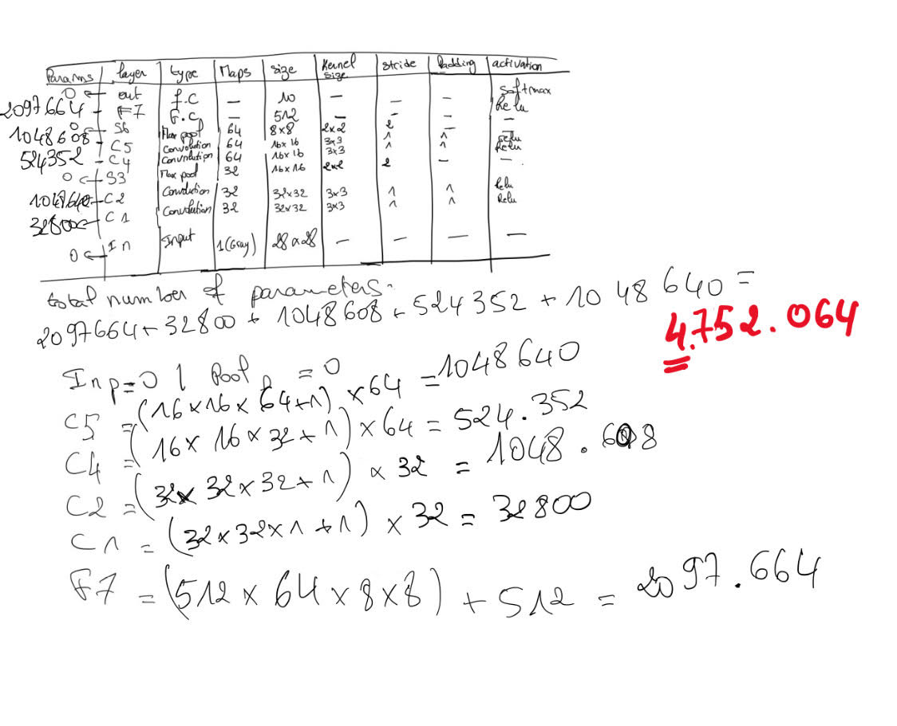

## Models
 The images are '28*28', so i thought about using tiny networks (prevent image shrinking)
During ths experiment i used 2 networks:
### Lenet-5 based network
This model we will be having 2 Conv2D layers with 6 and 16 filters each followed by a Max Polling layer of size 2 x 2 Using Eelu activation function.  
We also add a dropout regularization layer with ratio 0.5 to prevent any overfitting.
  Together with the dropout I used early stopping technique with a patience interval of 10, which means that after 10 epochs if validation loss is increasing(did not decrease), I stop the training and keep last saved weights 
Finally the model has a softmax layer with the 10 required classes as output.
 `NB` : Other modifications to the network:
- A batch normalization layer added after each convolutional layer
- Elu activation function(The original LeNet architecture used TANH activation functions rather than ELU) 
 ◦ ELU has nonlinearity and linearity at the same time.
 ◦ No “dying ReLU” problem.
- MaxPool instead of AvgPool 
- padding added to conv1 to prevent the image from being shrinked   

#### Network detailed description
A convolution neural net tries to learn the values of filter using backpropagation, which means if a layer has weight matrices, it is called a “learnable” layer.  
The number of parameters in a given layer is the count of “learnable” elements for a filter for that layer. 
As we can see in the figure, only conv layers and fully connected layers are learnable layers.  
The input layer , the pooling layers and the output have 0 learnable parameters. 

  
This network contains `58654` parameters almost same as LeNet-5 (Lenet-5 input is 32*32)

As we can see in the figure there is `60865`
### mini_VGG network

### mini_VGG Network detailed description
 
`Total number of parameters equal to 2.097.152`

## Benchmarking
| model | Accuracy | Training time |
| --- | --- | --- |
| CNN5 (lr=0.001, batch_size=64, shuffle=False) | 0.907 | 542|
| CNN5 (lr=0.001, batch_size=128, shuffle=False) | 0.908 | 592|
| mini_vgg (lr=0.001, batch_size=64, shuffle=False)| 0.922  | 755|
| mini_vgg (lr=0.001, batch_size=18, shuffle=False)| 0.921| 1152|

  CNN5 (lr=0.001, batch_size=64, shuffle=False)  
 CNN5 (lr=0.001, batch_size=128, shuffle=False) 
 mini_vgg (lr=0.001, batch_size=64, shuffle=False) 
mini_vgg (lr=0.001, batch_size=128, shuffle=False) 

### Test loss
 
### Train loss
 
### Accuracy
 

As the figures show the green model is the best  (lr=0.001, batch_size=64, shuffle=False)