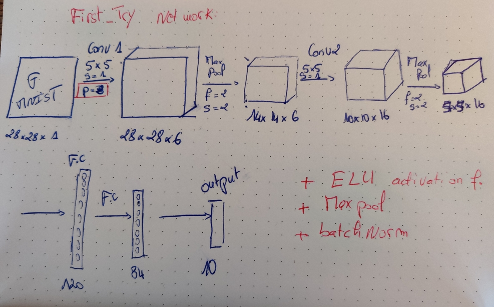
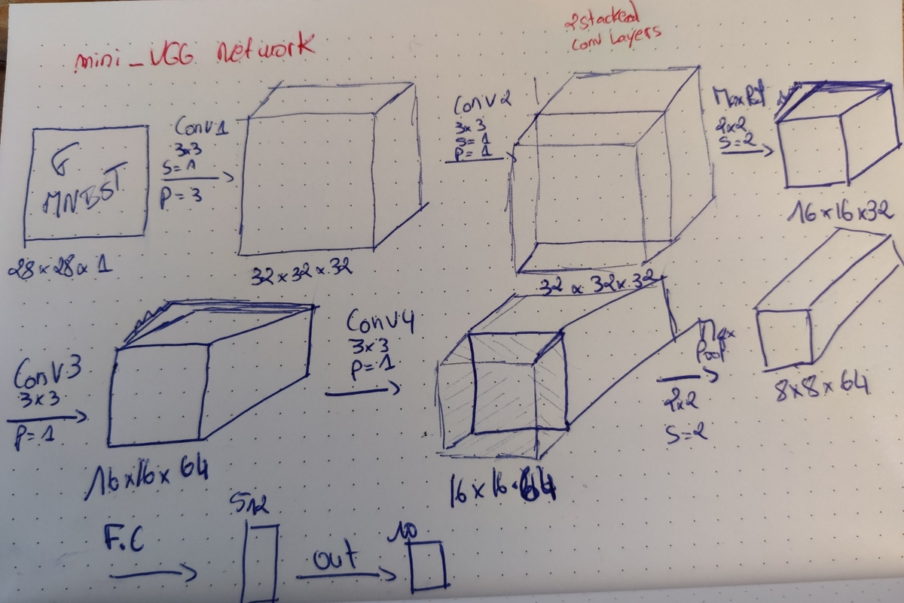

# Fashion Mnist Image classification
The task is to classify Fashion Mnist images to 10 classes which are:

| Label | Description |
| --- | --- |
| 0 | T-shirt/top |
| 1 | Trouser |
| 2 | Pullover |
| 3 | Dress |
| 4 | Coat |
| 5 | Sandal |
| 6 | Shirt |
| 7 | Sneaker |
| 8 | Bag |
| 9 | Ankle boot |
This is how the dataset looks like:  

 The images are '28*28', so i thought about using tiny networks (prevent image shrinking)
During ths experiment i used 2 networks:
### Lenet-5 based network

#### Network detailed description
  
`Total number of parameters equal to 58654`

### mini_VGG network

### mini_VGG Network detailed description
 
`Total number of parameters equal to 2.097.152`

## Benchmarking
| model | Accuracy | Training time |
| --- | --- | --- |
| CNN5 (lr=0.001, batch_size=64, shuffle=False) | 0.907 | 542|
| CNN5 (lr=0.001, batch_size=128, shuffle=False) | 0.908 | 592|
| mini_vgg (lr=0.001, batch_size=64, shuffle=False)| 0.922  | 755|
| mini_vgg (lr=0.001, batch_size=18, shuffle=False)| 0.921| 1152|
  CNN5 (lr=0.001, batch_size=64, shuffle=False) 
 CNN5 (lr=0.001, batch_size=128, shuffle=False) 
 mini_vgg (lr=0.001, batch_size=64, shuffle=False) 
mini_vgg (lr=0.001, batch_size=128, shuffle=False) 

### Test loss
 
### Train loss
 
### Accuracy
 
